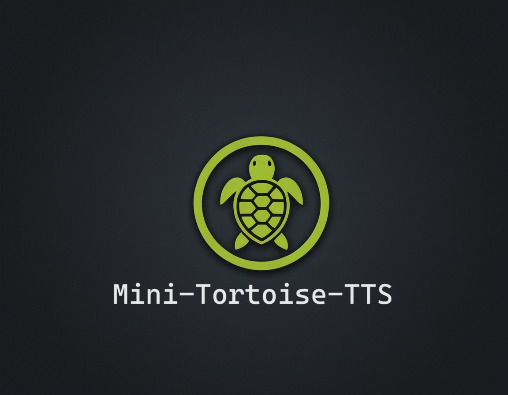

# MiniTortoiseTTS



MiniTortoiseTTS is a lightweight alternative to Tortoise TTS, designed to provide a simple and efficient text-to-speech
(TTS) solution without the overhead of voice cloning. This package offers typing support, making it an ideal
choice when you need to reduce the size of your project's dependencies.

## Features

* **Lightweight**: Built for minimalism, MiniTortoiseTTS reduces the payload of your projects while still delivering TTS
functionality.
* **Typing Support**: Enjoy improved code completion and type checking with our typing support enabled.
* **Easy Integration**: Seamlessly integrate MiniTortoiseTTS into your existing Python workflows.

## Use Cases

* When you need a simple TTS solution without voice cloning capabilities.
* To reduce the size of your project's dependencies while still providing essential TTS functionality.
* Local TTS generation

## Usage

To use MiniTortoiseTTS, simply import the library and start speaking!

```python
from mini_tortoise_tts.load_voices import Voice
from mini_tortoise_tts.text_to_speech import TextToSpeech

voice = Voice("mini-turtle")
text_to_speech = TextToSpeech(voice)
text_to_speech.tts("Hello World")
```